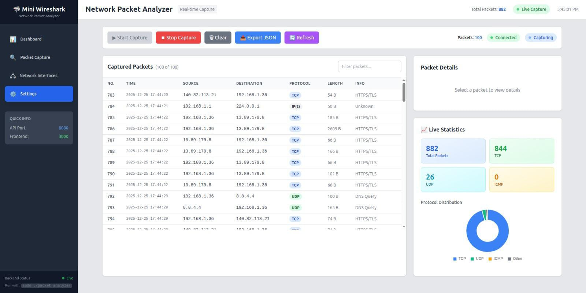

<div align="center">

# 🦈 Mini WireShark - Network Packet Analyzer

[](https://opensource.org/licenses/MIT)
[](https://isocpp.org/)
[](https://reactjs.org/)
[](https://www.typescriptlang.org/)

**A lightweight, real-time network packet analyzer with modern web interface**

*Capture, analyze, and visualize network traffic with ease*

</div>

---

## 📸 Application Preview



*Real-time packet capture showing live network traffic analysis with protocol statistics*

---

## 🎯 Why This Project?

### The Problem
Network analysis is crucial for:
- **Security Professionals**: Detecting malicious traffic, intrusions, and vulnerabilities
- **Developers**: Debugging network-related issues in applications
- **System Administrators**: Monitoring network health and performance
- **Students**: Learning about network protocols and packet structures

However, tools like Wireshark can be overwhelming for beginners and resource-heavy for simple tasks.

### The Solution
**Mini WireShark** provides:
- ✅ **Simplified Interface**: Clean, intuitive web UI without the complexity
- ✅ **Real-time Monitoring**: Live packet capture with instant visualization
- ✅ **Cross-Platform Access**: Access from any browser on your network
- ✅ **Modern Stack**: High-performance C++ backend with reactive frontend
- ✅ **Educational Value**: Clear protocol breakdown for learning purposes

---

## ✨ Features

### Backend (C++ with libpcap)
| Feature | Description |
|---------|-------------|
| 🔴 **Live Capture** | Real-time packet capturing using libpcap |
| 🔍 **Protocol Decoding** | Ethernet, IPv4, TCP, UDP, ICMP support |
| 📊 **Traffic Analysis** | Automatic statistics and pattern detection |
| 🌐 **REST API** | HTTP server exposing packet data as JSON |
| 📝 **Logging** | Comprehensive logging for debugging |

### Frontend (React/TypeScript)
| Feature | Description |
|---------|-------------|
| 📱 **Responsive Design** | Modern UI built with Tailwind CSS |
| ⚡ **Real-time Updates** | Live packet stream with auto-refresh |
| 🎨 **Protocol Highlighting** | Color-coded protocols for easy identification |
| 📈 **Statistics Dashboard** | Charts showing protocol distribution |
| 🔎 **Filtering** | Filter packets by protocol, IP, or content |
| 💾 **Export** | Download captured packets as JSON |

---

## 🏗️ Architecture

```
┌─────────────────────────────────────────────────────────────────┐
│                         User Browser                            │
│                    http://localhost:3000                        │
└─────────────────────────────┬───────────────────────────────────┘
                              │ HTTP/JSON
                              ▼
┌─────────────────────────────────────────────────────────────────┐
│                     React Frontend                              │
│  ┌───────────┐  ┌───────────┐  ┌───────────┐  ┌───────────┐   │
│  │ Dashboard │  │PacketList │  │Statistics │  │  Details  │   │
│  └───────────┘  └───────────┘  └───────────┘  └───────────┘   │
└─────────────────────────────┬───────────────────────────────────┘
                              │ REST API (Port 8080)
                              ▼
┌─────────────────────────────────────────────────────────────────┐
│                    C++ Backend Server                           │
│  ┌───────────┐  ┌───────────┐  ┌───────────┐  ┌───────────┐   │
│  │HTTP Server│  │ Analyzer  │  │  Decoder  │  │  Capture  │   │
│  └───────────┘  └───────────┘  └───────────┘  └───────────┘   │
└─────────────────────────────┬───────────────────────────────────┘
                              │ libpcap
                              ▼
┌─────────────────────────────────────────────────────────────────┐
│                    Network Interface                            │
│                  (eth0, wlan0, etc.)                           │
└─────────────────────────────────────────────────────────────────┘
```

---

### Manual Setup

#### Prerequisites
- **C++ Compiler**: GCC 7+ or Clang 5+
- **CMake**: 3.10+
- **libpcap**: Development headers
- **Node.js**: 16+
---

## 🚀 Quick Start

### Prerequisites

| Requirement | Version | Purpose |
|-------------|---------|---------|
| **C++ Compiler** | GCC 7+ / Clang 5+ | Backend compilation |
| **CMake** | 3.10+ | Build system |
| **libpcap** | Latest | Packet capture |
| **Node.js** | 16+ | Frontend runtime |
| **npm** | 7+ | Package management |

### Installation

#### 1. Install System Dependencies

**Ubuntu/Debian:**
```bash
sudo apt-get update
sudo apt-get install -y cmake build-essential pkg-config libpcap-dev nodejs npm
```

**macOS:**
```bash
brew install cmake libpcap node
```

**Arch Linux:**
```bash
sudo pacman -S cmake base-devel libpcap nodejs npm
```

#### 2. Build the Backend
```bash
cd WireShark/cpp-packet-analyzer
mkdir -p build && cd build
cmake ..
make -j$(nproc)
```

#### 3. Setup the Frontend
```bash
cd frontend
npm install
```

---

## ▶️ Running the Application

### Step 1: Start Backend (requires root for packet capture)
```bash
cd WireShark/cpp-packet-analyzer/build
sudo ./packet_analyzer
```

### Step 2: Start Frontend
```bash
cd frontend
npm start
```

### Step 3: Open Browser
Navigate to **http://localhost:3000**

---

## 🔌 API Reference

| Endpoint | Method | Description | Response |
|----------|--------|-------------|----------|
| `/api/packets` | GET | Retrieve captured packets | JSON array |
| `/api/stats` | GET | Get capture statistics | JSON object |
| `/api/start` | POST | Start packet capture | Status |
| `/api/stop` | POST | Stop packet capture | Status |
| `/api/clear` | POST | Clear captured packets | Status |

### Example Response (`/api/packets`)
```json
{
  "packets": [
    {
      "id": 1,
      "timestamp": "2025-12-25 17:44:20",
      "source": "192.168.1.36",
      "destination": "140.82.113.21",
      "protocol": "TCP",
      "length": 54,
      "info": "HTTPS/TLS"
    }
  ],
  "total": 882,
  "capturing": true
}
```

---

## 📖 Usage Guide

| Action | How To |
|--------|--------|
| **Start Capture** | Click the green "▶ Start Capture" button |
| **Stop Capture** | Click the red "⏹ Stop Capture" button |
| **View Packets** | Packets appear in real-time in the table |
| **Filter Packets** | Use the filter input to search by IP/protocol |
| **View Statistics** | Check the right sidebar for live stats |
| **Export Data** | Click "📥 Export JSON" to download packets |
| **Refresh Data** | Click "🔄 Refresh" to manually update |

---

## 🛠️ Development

### Backend Development
```bash
# Debug build
cd WireShark/cpp-packet-analyzer/build
cmake -DCMAKE_BUILD_TYPE=Debug ..
make

# Run tests
make test

# Clean build
make clean
```

### Frontend Development
```bash
cd frontend

# Development server with hot reload
npm start

# Production build
npm run build

# Run tests
npm test

# Lint code
npm run lint
```

---

## 🔒 Security Considerations

> ⚠️ **Important**: This tool requires root/administrator privileges to capture packets.

- Only run on networks you own or have permission to monitor
- Be aware of privacy laws in your jurisdiction
- Do not use for malicious purposes
- Captured data may contain sensitive information

---

## 🤝 Contributing

Contributions are welcome! Please feel free to submit a Pull Request.

1. Fork the repository
2. Create your feature branch (`git checkout -b feature/AmazingFeature`)
3. Commit your changes (`git commit -m 'Add some AmazingFeature'`)
4. Push to the branch (`git push origin feature/AmazingFeature`)
5. Open a Pull Request

---

## 📄 License

This project is licensed under the MIT License - see the [LICENSE](WireShark/cpp-packet-analyzer/LICENSE) file for details.

---

## 🙏 Acknowledgments

- [libpcap](https://www.tcpdump.org/) - Packet capture library
- [React](https://reactjs.org/) - Frontend framework
- [Tailwind CSS](https://tailwindcss.com/) - Styling framework
- [Chart.js](https://www.chartjs.org/) - Statistics visualization
- Inspired by [Wireshark](https://www.wireshark.org/)

---

<div align="center">

**Built with ❤️ for network enthusiasts**

*If you find this project useful, please consider giving it a ⭐*

</div>

